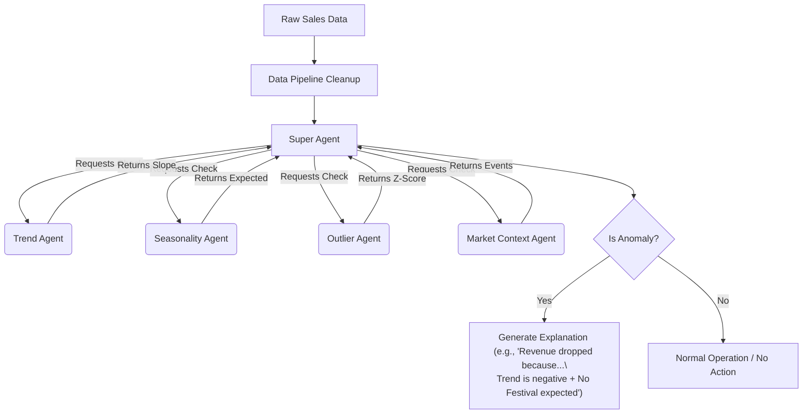

# JumpIQ — Dealership Intelligence Engine

A **Dealership Intelligence Engine** that analyzes dealership data (revenue, valuation, market momentum, environment score) similar to stock market analysis, financial forecasting, and anomaly detection—but for dealerships.

---

## 1. What This Project Is

**Goal:** Automatically detect patterns and problems in dealership data.

The platform already shows:

- Revenue trend lines
- Momentum vs Environment
- Quadrant classification (Champions / Stragglers / Opportunities)

The system goal is to **detect patterns and anomalies** and **trace back reasons** (real event vs seasonal vs data bug vs wrong model).

---

## 2. Core Problem

Graphs can show **sudden spikes or drops**. The system must decide whether each change is:

| # | Possibility        | Example                    |
|---|--------------------|----------------------------|
| 1 | Real business event| New product launch         |
| 2 | Seasonal spike     | Festival / holiday sales   |
| 3 | Data bug           | Wrong ETL or bad source    |
| 4 | Wrong model        | Incorrect algorithm output |

**Requirement:** The system should **detect anomaly and trace back reason**.

---

## 3. High-Level Pipeline

```
RAW DATA  →  Cleaning  →  Models  →  Derived Values  →  Rules  →  Database  →  UI
```

- **Raw data:** DMS, sales, financials, real estate valuation
- **Cleaning:** Missing data, wrong values, duplicates (e.g. imputation)
- **Models:** Trend, seasonality, anomaly detection, forecasting (time series)
- **Derived values:** Valuation Score, Profitability Score, Momentum Score, Market Health Score
- **Rules:** e.g. "if revenue growth > 20% and market stable → opportunity"
- **Database:** Store processed data
- **UI:** Dashboards, graphs, quadrants

Details: [docs/PIPELINE.md](docs/PIPELINE.md)

---

## 4. Pattern Detection (Why Different Algorithms Matter)

Different algorithms detect different patterns:

| Pattern        | Example                    | Algorithms / Ideas              |
|----------------|----------------------------|---------------------------------|
| **Trend**      | Revenue increasing steadily| Linear regression, slope       |
| **Seasonality**| Oct/Nov spike every year   | Seasonal decomposition, Prophet, ARIMA |
| **Outliers**   | Sales 120 → 2 suddenly     | Z-score, IQR, Isolation Forest  |
| **Event impact**| Crash, fuel spike, policy | Event-based / causal analysis   |

Details: [docs/PATTERN-DETECTION.md](docs/PATTERN-DETECTION.md)

---

## 5. Multi-Agent Architecture (Proposed)

We are developing a **Multi-Agent Architecture** where specialized AI agents collaborate to investigate issues automatically.



| Agent             | Job                      |
|-------------------|--------------------------|
| Super Agent       | Orchestrator. Triggers tests and compiles the final human-readable explanation. |
| Trend Agent       | Analyzes steady growth / decline (Champions vs Stragglers) |
| Outlier Agent     | Detects abnormal, unexpected spikes using Z-Scores & bounds |
| Seasonality Agent | Detects recurring, expected cycles (e.g., Holidays) |
| Market Agent      | Checks external competitor trends and economic events |

**Why not neural networks:** The system must **explain** its reasoning (e.g., "Revenue dropped because: inventory low, competitor price drop, no seasonal boost expected"). Black box neural networks fail at explainability. Therefore, we prefer **interpretable models**: regression, statistical rules, and explicit time series forecasting.

Details: [docs/AGENTS.md](docs/AGENTS.md)

---

## 6. Tools Agents Can Use

- **Database** — existing dealership metrics
- **Web search** — market trends
- **MCP** — tool integrations
- **DMS** — dealer management systems

---

## 7. Phase 1 Task (Current Focus)

**Directive:** *Understand algorithms deeply* — not just run code.

1. Learn **pattern detection**
2. Learn **time-series analysis**
3. Learn **anomaly detection**
4. Send **daily report**

**Study first:** [docs/PHASE1-STUDY.md](docs/PHASE1-STUDY.md)

**Start-to-end saare phases (Phase 1 → 6, evolving system tak):** [docs/ROADMAP.md](docs/ROADMAP.md)

---

## 8. Principles to Follow During Exploration

Do **not** jump straight to coding. Think like a data scientist/engineer:

- **Understand** patterns first (trend, seasonality, outliers, events), then algorithms.
- **Always question the data** — never trust raw data blindly; trace reasons for anomalies.
- **Follow the pipeline:** clean → validate → analyze (never run models on raw data only).
- **Time-series thinking** — revenue/month, valuation/quarter, momentum over time.
- **Interpretable models** — avoid black-box neural networks; prefer regression, rules, decomposition.
- **Investigation mindset** — system should explain *why* (e.g. "Revenue dropped because …").
- **Relate everything to JumpIQ** — every concept must answer: *How does this help analyze dealership data?*
- **Daily reports** — what you studied + how it applies to dealership revenue.

**Full list (15 rules):** [docs/EXPLORATION-PRINCIPLES.md](docs/EXPLORATION-PRINCIPLES.md)

**Core rule:** Understand → Analyze → Explain → Then Implement. Complete this understanding ASAP so we can implement.

---

## 9. Tech Stack

| Layer     | Technology                                           |
|-----------|------------------------------------------------------|
| Backend   | Python, FastAPI, uvicorn                             |
| Frontend  | Angular 21, TypeScript, ECharts (ngx-echarts)        |
| Data      | Pandas, NumPy                                        |
| Models    | statsmodels (seasonal decomposition), scikit-learn   |
| Forecasting | Prophet (planned), ARIMA (planned)                 |

---

## 10. Project Layout

```
Dealership-Intelligence-Engine/
├── README.md                       # This file
├── requirements.txt                # Python deps for exploration scripts
├── data/                           # Sample raw data files
│   ├── helix_sample.csv
│   └── polk_sample.csv
│
├── docs/                           # Project documentation
│   ├── ROADMAP.md                  # Phase 1 → 6 roadmap
│   ├── PIPELINE.md                 # Data pipeline stages
│   ├── PATTERN-DETECTION.md        # Pattern types & algorithms
│   ├── AGENTS.md                   # Multi-agent architecture design
│   ├── EXPLORATION-PRINCIPLES.md   # 15 rules for thinking like a data scientist
│   ├── PHASE1-STUDY.md             # What to study first
│   ├── algorithms/                 # Algorithm deep-dive docs
│   │   ├── trend_detection.md      # Beginner's guide to trend detection
│   │   └── seasonality_detection.md # Beginner's guide to seasonality
│   └── learning/                   # Learning reference notes
│       ├── TREND_AND_SEASONALITY.md
│       └── ANOMALY_DETECTION.md
│
└── exploration/                    # Phase 1 experiments & PoC web app
    ├── README.md                   # Exploration guide
    ├── script/                     # Standalone learning scripts
    │   ├── trend_detection.py      # Trend: slope, moving avg, period comparison
    │   └── seasonality_detection.py # Seasonality: decomposition, residuals
    └── web app/                    # Working PoC dashboard
        ├── backend/                # FastAPI backend (Python)
        │   ├── main.py             # App entry point, CORS, router setup
        │   ├── requirements.txt    # Backend Python dependencies
        │   ├── data/               # Data source layer
        │   │   ├── __init__.py
        │   │   └── dealerships.py  # Mock dealership revenue data (DEALERSHIPS, MONTHS)
        │   ├── algorithms/         # Algorithm implementations
        │   │   ├── __init__.py
        │   │   ├── trend.py        # Slope, trend line, moving avg, classify
        │   │   └── seasonality.py  # Seasonal decomposition (statsmodels)
        │   └── routers/            # API route handlers
        │       ├── __init__.py
        │       ├── trends.py       # GET /api/trends, /api/trends/{dealership}
        │       └── seasonality.py  # GET /api/seasonality, /api/seasonality/{dealership}
        └── frontend/               # Angular 21 dashboard (TypeScript)
            ├── angular.json
            ├── package.json
            └── src/app/
                ├── app.ts                    # Root component
                ├── app.config.ts             # Providers (HttpClient, zone.js)
                ├── services/
                │   └── intelligence.service.ts # HTTP service + TypeScript interfaces
                ├── dashboard/
                │   ├── dashboard.component.ts    # Main dashboard logic
                │   ├── dashboard.component.html  # Template (cards, charts, tabs)
                │   └── dashboard.component.scss  # Styles
                └── charts/
                    ├── trend-chart.component.ts       # ECharts trend visualization
                    └── seasonality-chart.component.ts # ECharts seasonality visualization
```

---

## 11. Running the PoC Web App

### Backend (FastAPI)

```bash
cd exploration/web\ app/backend
pip install -r requirements.txt
uvicorn main:app --reload
# → http://localhost:8000
```

**API endpoints:**

| Method | Endpoint                        | Description                     |
|--------|---------------------------------|---------------------------------|
| GET    | `/`                             | Health check + endpoint list    |
| GET    | `/api/trends/`                  | Trend data for all dealerships  |
| GET    | `/api/trends/{dealership}`      | Trend data for one dealership   |
| GET    | `/api/seasonality/`             | Seasonality for all dealerships |
| GET    | `/api/seasonality/{dealership}` | Seasonality for one dealership  |

### Frontend (Angular)

```bash
cd exploration/web\ app/frontend
npm install
npx ng serve
# → http://localhost:4200
```

The dashboard shows:
1. **Classification cards** — Each dealership labeled CHAMPION / STRAGGLER / AT RISK / RECOVERING
2. **Revenue trend chart** — Revenue lines + trend lines + 3-month moving averages (ECharts)
3. **Seasonality decomposition** — Observed / Trend / Seasonal / Residual breakdown per dealership

---

## 12. How the Code Connects

```
Frontend (Angular)                    Backend (FastAPI)
─────────────────                     ─────────────────
intelligence.service.ts               main.py
  → GET /api/trends/        ───→        routers/trends.py
                                          → algorithms/trend.py
                                              → data/dealerships.py (DEALERSHIPS, MONTHS)
  → GET /api/seasonality/   ───→        routers/seasonality.py
                                          → algorithms/seasonality.py
                                              → data/dealerships.py (DEALERSHIPS, MONTHS)

dashboard.component.ts
  ← receives JSON ──────────────── ← returns { dealerships: [...] }
  → renders cards + charts
```

**Data flow:** `dealerships.py` → algorithm functions → router endpoints → Angular service → dashboard UI

---

## 13. Why This Project Matters

This is high-level work across:

- Data engineering
- Data science
- System design
- AI agents
- Analytics pipelines

Very few backend engineers get this breadth. Use Phase 1 to build a strong foundation in algorithms and time series, then layer on agents and pipeline.
